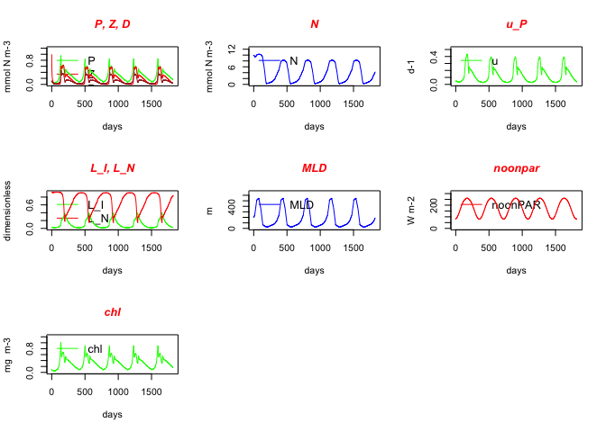

<!-- README.md is generated from README.Rmd. Please edit that file -->
EMPOWER
=======

The goal of EMPOWER is to provide a package-style wrapper around the [EMPOWER model](https://www.geosci-model-dev.net/8/2231/2015/) (Efficient Model of Planktonic ecOsystems WrittEn in R).

Installation
------------

You can install **EMPOWER** from github using:

``` r
# install.packages("devtools")
devtools::install_github("paleolimbot/EMPOWER")
```

Example
-------

The model is run using the `EMPOWER()` function, which takes a parameter set generated by `model_params()` (or alternatively, `default_model_params()`).

``` r
# load EMPOWER
library(EMPOWER)

# generate the parameter set
params <- default_model_params()

# run the model
EMPOWER(params)
#> [1] "**************************************************"
#> [1] "                                                  "
#> [1] "input: model parameters read in from file NPZD_parms.txt"
#> [1] "input: model run characteristics read in from file NPZDextra.txt"
#> [1] "                                                  "
#> [1] "**************************************************"
#> [1] "annual fluxes (last year): P N Z D"
#> [1] "                                                  "
#>              [,1]       [,2]       [,3]       [,4]
#>  [1,]  19.9372314   2.229486  9.2540455  1.6931745
#>  [2,] -16.0498770   3.084682 -1.2527598  1.1498485
#>  [3,]  -1.6931745   2.462532 -7.4203244  1.2527598
#>  [4,]  -1.1498485 -19.937231 -0.3961475  5.5434862
#>  [5,]  -0.2591616  21.916158 -0.1848138 -1.8323364
#>  [6,]  -0.7851699  -9.755626  0.0000000 -0.1011722
#>  [7,]   0.0000000   0.000000  0.0000000 -5.0041347
#>  [8,]   0.0000000   0.000000  0.0000000 -2.4625317
#>  [9,]   0.0000000   0.000000  0.0000000 -0.2390939
#> [10,]   0.0000000   0.000000  0.0000000  0.0000000
#> [1] "Total, each state var:                            "
#> [1] -4.329870e-14  1.154632e-13 -1.371125e-14 -5.051515e-15
#> [1] "                                                  "
#> [1] "output: state varibles written to file out_statevars.txt"
#> [1] "output: terms in differential equations written to file out_fluxes.txt"
#> [1] "output: auxiliary variables written to file out_aux.txt"
#> [1] "                                                  "
#> [1] "**************************************************"
#> $aux
#> # A tibble: 366 x 21
#>       V1      V2     V3      V4    V5    V6     V7    V8    V9      V10
#>    <int>   <dbl>  <dbl>   <dbl> <dbl> <dbl>  <dbl> <dbl> <dbl>    <dbl>
#>  1  1460 0.02417 0.8346 0.03687 194.0 82.45 0.1597 12.93 1.077 0.005553
#>  2  1461 0.02397 0.8362 0.03658 197.2 82.79 0.1583 12.90 1.078 0.005464
#>  3  1462 0.02379 0.8378 0.03632 200.4 83.17 0.1571 12.88 1.079 0.005383
#>  4  1463 0.02363 0.8393 0.03608 203.6 83.59 0.1559 12.86 1.081 0.005307
#>  5  1464 0.02348 0.8407 0.03586 206.8 84.03 0.1548 12.83 1.083 0.005237
#>  6  1465 0.02335 0.8421 0.03566 210.0 84.51 0.1537 12.81 1.086 0.005172
#>  7  1466 0.02322 0.8434 0.03548 213.2 85.02 0.1527 12.78 1.090 0.005112
#>  8  1467 0.02311 0.8448 0.03531 216.4 85.56 0.1518 12.76 1.094 0.005056
#>  9  1468 0.02302 0.8460 0.03516 219.6 86.13 0.1509 12.74 1.099 0.005005
#> 10  1469 0.02293 0.8473 0.03503 222.8 86.73 0.1501 12.71 1.105 0.004959
#> # ... with 356 more rows, and 11 more variables: V11 <dbl>, V12 <dbl>,
#> #   V13 <int>, V14 <int>, V15 <int>, V16 <int>, V17 <int>, V18 <int>,
#> #   V19 <int>, V20 <int>, V21 <int>
#> 
#> $fluxes
#> # A tibble: 366 x 41
#>       V1        V2         V3         V4         V5         V6         V7
#>    <int>     <dbl>      <dbl>      <dbl>      <dbl>      <dbl>      <dbl>
#>  1  1460 0.0005553 -1.421e-04 -0.0002259 -5.672e-05 -1.009e-05 -0.0002489
#>  2  1461 0.0005464 -1.361e-04 -0.0002241 -5.579e-05 -9.848e-06 -0.0002428
#>  3  1462 0.0005383 -1.305e-04 -0.0002223 -5.491e-05 -9.614e-06 -0.0002370
#>  4  1463 0.0005307 -1.252e-04 -0.0002206 -5.409e-05 -9.391e-06 -0.0002316
#>  5  1464 0.0005237 -1.202e-04 -0.0002190 -5.331e-05 -9.179e-06 -0.0002263
#>  6  1465 0.0005172 -1.156e-04 -0.0002175 -5.258e-05 -8.977e-06 -0.0002213
#>  7  1466 0.0005112 -1.112e-04 -0.0002161 -5.190e-05 -8.784e-06 -0.0002166
#>  8  1467 0.0005056 -1.071e-04 -0.0002148 -5.126e-05 -8.601e-06 -0.0002121
#>  9  1468 0.0005005 -1.032e-04 -0.0002135 -5.066e-05 -8.425e-06 -0.0002077
#> 10  1469 0.0004959 -9.955e-05 -0.0002123 -5.010e-05 -8.258e-06 -0.0002036
#> # ... with 356 more rows, and 34 more variables: V8 <int>, V9 <int>,
#> #   V10 <int>, V11 <int>, V12 <dbl>, V13 <dbl>, V14 <dbl>, V15 <dbl>,
#> #   V16 <dbl>, V17 <dbl>, V18 <int>, V19 <int>, V20 <int>, V21 <int>,
#> #   V22 <dbl>, V23 <dbl>, V24 <dbl>, V25 <dbl>, V26 <dbl>, V27 <int>,
#> #   V28 <int>, V29 <int>, V30 <int>, V31 <int>, V32 <dbl>, V33 <dbl>,
#> #   V34 <dbl>, V35 <dbl>, V36 <dbl>, V37 <dbl>, V38 <dbl>, V39 <dbl>,
#> #   V40 <dbl>, V41 <int>
#> 
#> $statevars
#> # A tibble: 366 x 5
#>       V1     V2    V3      V4      V5
#>    <int>  <dbl> <dbl>   <dbl>   <dbl>
#>  1  1460 0.1506 4.293 0.03508 0.04009
#>  2  1461 0.1493 4.343 0.03414 0.03961
#>  3  1462 0.1481 4.392 0.03322 0.03915
#>  4  1463 0.1470 4.440 0.03235 0.03871
#>  5  1464 0.1460 4.488 0.03150 0.03830
#>  6  1465 0.1450 4.535 0.03068 0.03790
#>  7  1466 0.1440 4.582 0.02989 0.03752
#>  8  1467 0.1431 4.628 0.02913 0.03715
#>  9  1468 0.1423 4.673 0.02839 0.03680
#> 10  1469 0.1415 4.718 0.02768 0.03647
#> # ... with 356 more rows
#> 
#> $params
#> <model_params>
#>   VPmax alpha   kN    mP   mp2 Imax  kz phiP phiD betaz  kNz   mz  mz2
#> 1   2.5  0.15 0.85 0.015 0.025    1 0.6 0.67 0.33  0.69 0.75 0.02 0.34
#>     VD   mD wmix CtoChl Pinit Ninit Zinit Dsinit   kw   kc tstep nyears
#> 1 6.43 0.06 0.13     75   0.1    10     1    0.1 0.04 0.03   0.1      5
#>   flag_stn flag_LI flag_atten flag_irrad flag_PIcurve flag_grazing
#> 1        2       1          2          2            1            2
#>   flag_outtype flag_outfreq flag_integ
#> 1            1            1          1
#> 
#> attr(,"class")
#> [1] "EMPOWER_result"
```


